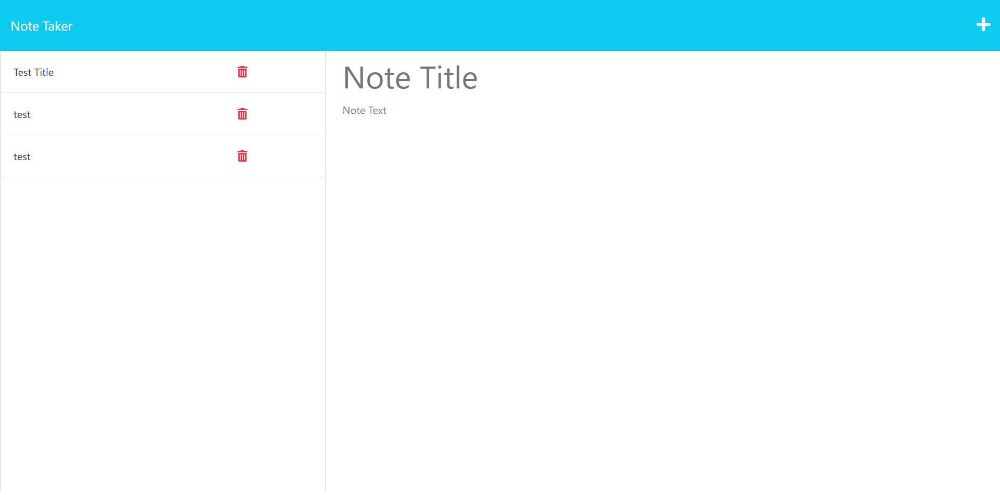

# Note Taker

## Description
Application that can be used to write and save notes. 

## Table of Contents 
 * [Installation](#installation) 
 * [Usage](#usage) 
 * [Credits](#credits) 
 * [License](#license) 
 * [Features](#features) 
 * [Tests](#tests) 
 * [Questions](#questions)

## Installation
1. Clone this repository to your local machine or download it as a ZIP file and extract it.
2. Open a terminal or command prompt and navigate to the projects directory.
3. use 'NPM install' to install project dependencies

## Usage

1. Visit https://ajm-chall-11-note-taker-1f7175607291.herokuapp.com/
2. Click 'Get Srarted'
3. Begin writing notes 

## Credits
UCB Starter code

## License

N/A

## Visuals 

## Questions 
 If you have further questions you can reach me at averyjmyers@outlook.com or visit my GitHub profile at github.com/averyjmyers.